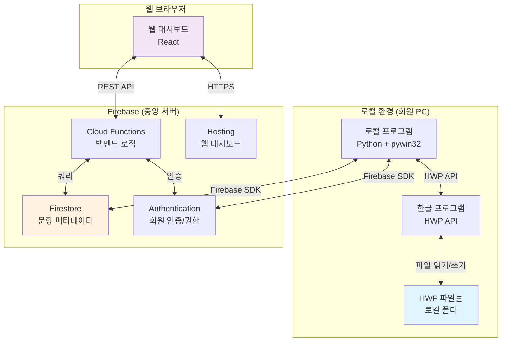
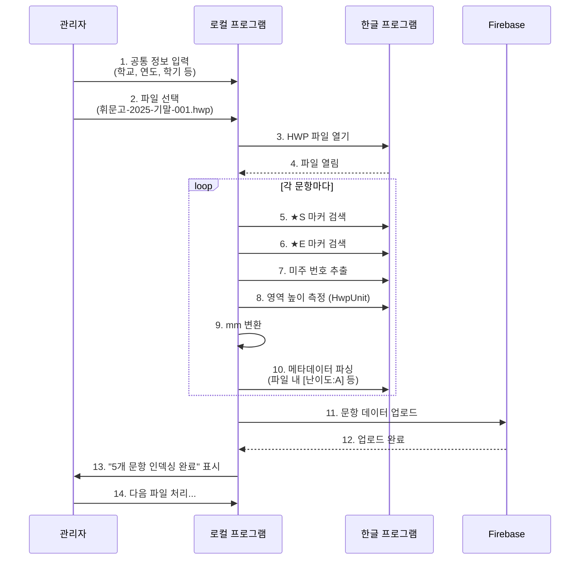
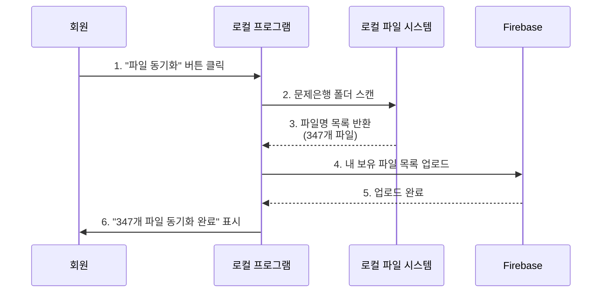
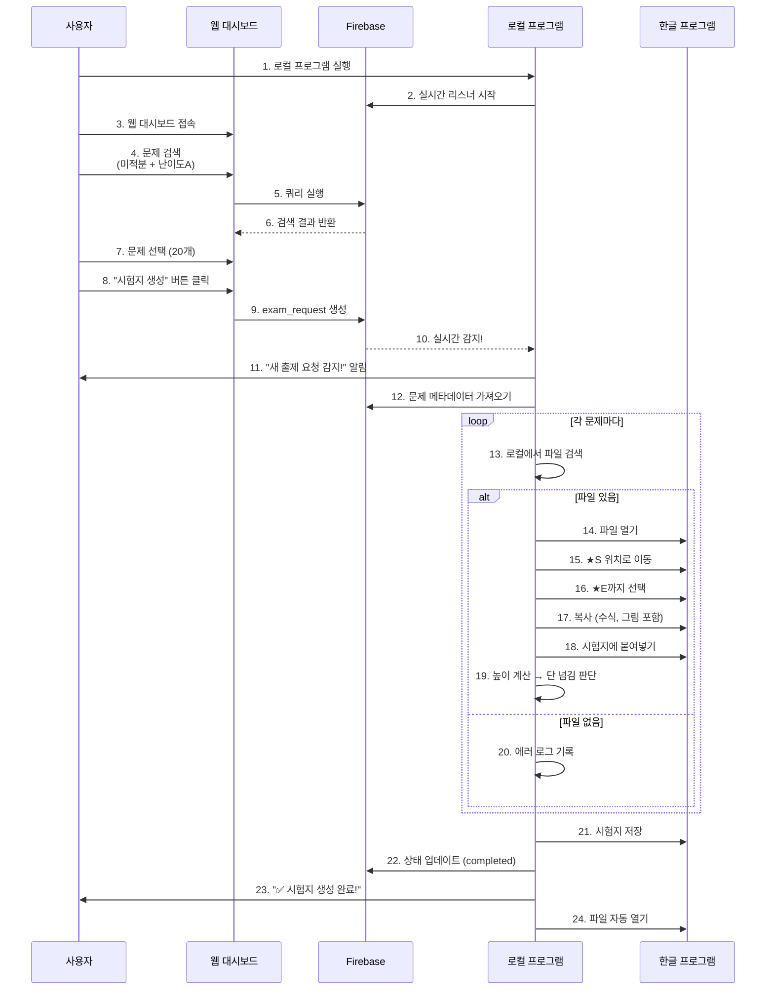

# 🚀 상승수학 문항 관리 시스템 (AnG 엔진) - 시스템 아키텍처 설계서

---
## ⚠️ AI 개발 규칙 (Claude 필독)

> **코드 수정 후에는 반드시 프로그램을 재실행한다.**
> ```
> taskkill /F /IM python.exe 2>nul & cd /d "G:\문제은행\문제은행2" & start pythonw backend/main_gui.py
> ```
> 수정 완료 보고 전에 재실행까지 완료할 것.

---

## 📐 DB 필드 포맷 규칙 (절대 준수)

### difficulty (난이도)
**DB 저장값은 반드시 영문 단일 코드 `A / B / C / D`**

| 코드 | 표시 | 설명 |
|------|------|------|
| `A`  | 최상 | 킬러 문제 |
| `B`  | 상   | 준킬러 |
| `C`  | 중   | 보통 |
| `D`  | 하   | 쉬움 |

- UI 필터: `vars_diff = {"A": ..., "B": ..., "C": ..., "D": ...}`
- 정렬 키: `l_map = {'D': 0, 'C': 1, 'B': 2, 'A': 3}`
- 표시: `level_map = {"A": "최상", "B": "상", "C": "중", "D": "하"}`

**한글(`상/중/하/최상`)로 저장하면 필터 전체 고장. 절대 금지.**

인덱서에서 한글로 반환하더라도 `_parse_tag` 또는 파서 레벨에서 영문 변환 필수:
```python
_kr = {"최상": "A", "상": "B", "중": "C", "하": "D"}
difficulty = _kr.get(raw, raw)  # 한글이면 변환, 이미 영문이면 그대로
```

### source (소스 타입)
`NAESIN_ANG` / `SUNEUNG_SPECIAL` / `SUNEUNG_COMPLETE` / `MOCK_EXAM` / `TEXTBOOK`

### unit_code (단원 코드)
2022 개정 기준 영문+숫자 2자리: `A1` ~ `V3`

---

## 📋 목차
1. [시스템 개요](#시스템-개요)
2. [문제 소스 분류 체계](#문제-소스-분류-체계)  ← NEW (v4.0)
3. [기술 스택](#기술-스택)
4. [시스템 구조도](#시스템-구조도)
5. [데이터베이스 스키마](#데이터베이스-스키마)
6. [핵심 워크플로우](#핵심-워크플로우)
7. [UI 설계 - 문제 등록 화면](#ui-설계---문제-등록-화면)  ← NEW (v4.0)
8. [UI 설계 - 랜덤 출제 화면](#ui-설계---랜덤-출제-화면)  ← NEW (v4.0)
9. [개발 로드맵 (Phase 1/2/3)](#개발-로드맵)
10. [보류 사항](#보류-사항)

---

## 시스템 개요

### 프로젝트 목표
대치동 상승수학학원의 수학 문항을 데이터베이스화하여, 원하는 조건에 맞춰 새 시험지(HWP)를 자동 생성하는 시스템

### 핵심 원칙
- **로컬-클라우드 하이브리드**: 실제 HWP 파일은 로컬 보관, 메타데이터와 **정밀 좌표 정보(pos_start, pos_end)**는 서버(Firebase)에 통합 관리하여 회원 간 공유 지원
- **파일명 기반 인덱싱**: 관리자가 인덱싱한 좌표 데이터를 서버로 전송하면, 동일한 한글 파일을 보유한 회원은 별도 인덱싱 없이 즉시 사용 가능
- **정밀 위치 추적**: 미주(Endnote) 기반 실시간 추적을 통해 파일 내 텍스트 밀림(엔터 등) 현상에도 강건한 복사 지원
- **확장 가능 설계**: 5단계 권한 시스템, 다양한 출제 옵션 지원
- **HWP 직접 제어**: 한글 프로그램 COM API를 통한 직접 제어 방식 채택

### ⚠️ 운영 역할 분리 (2026-05-23 확정)
| 기능 | 거점 | 진입점 |
|---|---|---|
| **문제 출제** | 🌐 **SC (학원 서버)** | `server/` — FastAPI + HTMX + Firestore 캐시. 브라우저(맥/윈도우 무관) |
| **문제 등록 (인덱싱)** | 💻 **로컬** (학원 PC) | `backend/main_gui.py` + HWP COM (Windows 전용) |

- **인덱싱 관련 코드** (`backend/indexers/*`, `backend/curriculum_config.json`, `backend/unit_hierarchy.json`, `backend/hwp_metadata_parser_v2.py`, `backend/indexers/naesin_n_unit_map.json` 등) 는 **로컬 위주로** 손볼 것.
- **출제 관련 코드** (`server/routes/api_exam.py`, `server/templates/random_exam.html` 등) 는 **SC 위주로** 손볼 것.
- 공유 모듈 (`backend/firestore_engine.py`, `backend/data_cache.py`, `backend/hwp_generator.py`) 은 양쪽 호환 유지.
- 자세한 내용: `서버클라이언트_설계도.md` § 0-B

### HWP 문제 구조

#### 태그 있는 소스 (내기왕 등)

```
[휘문고/2024-1-2-F/수학하/객/E2/D/A]  ← 인덱싱 태그 (메타데이터)
1) 문제 내용~~~~                      ← 미주번호 (문제 시작점)
~~~~
~~~~
```

**문제 범위 탐지 방식 (태그 소스)**:
- **시작점**: 미주 위치 기준 1단락 위 (태그 위치)
- **끝점**: 다음 미주 위치 또는 문서 끝
- **끝 마커 불필요**: 미주 번호만으로 범위 자동 결정

#### 태그 없는 소스 (수능특강 등)

```
@예제                                 ← 유형 마커 (문제 유형 표시)
1) 문제 내용~~~~                      ← 미주번호 (문제 시작점)
~~~~
~~~~
```

**문제 범위 탐지 방식 (비태그 소스)**:
- **시작점**: 미주 위치 (태그 소스와 동일)
- **끝점**: 다음 미주 위치 또는 문서 끝 (태그 소스와 동일)
- **경계 탐지에 마커 불필요**: 미주 번호만으로 범위 자동 결정 (내기왕과 동일)

**`@` 유형 마커 (수능특강 전용) — 확정**:
- 형식: `@` 단독 문자 (명칭 없음, 모든 섹션 경계에 동일하게 사용)
- 역할 1: **섹션 유형 분류** — 직전에 나온 `@` 개수로 섹션 결정
- 역할 2: **직전 섹션 마지막 문제의 끝점** — 미주만으로 끝을 못 잡을 때 `@` 위치가 강제 종료점
- 파일 1개당 마커 3~4개 (수작업 부담 최소)
- **삽입 방식**: 내기왕 태그(`[학교/...]`)와 동일하게 **투명(흰색) 텍스트**로 삽입
  - 인쇄/출력 시 보이지 않음
  - 파이썬 텍스트 추출 시 정상적으로 읽힘 (글자 색상과 무관)
  - 수작업 편의상 두 소스 모두 동일한 방식 사용

**파일 내 섹션 구조 (확정)**:
```
[예제/유제 문제들]   ← @ 0개 (파일 시작 ~ 첫 @ 이전)  난이도: 하
@                    ← 첫째 마커
[레벨1 문제들]       ← @ 1개                           난이도: 중
@                    ← 둘째 마커
[레벨2 문제들]       ← @ 2개                           난이도: 상
@                    ← 셋째 마커
[레벨3 문제들]       ← @ 3개                           난이도: 최상
@                    ← 넷째 마커 (레벨3 마지막 문제 끝점)
```

- 대표기출 없음 (수능특강에 해당 없음)
- `@` 마커는 파일당 항상 **4개** 고정

**파서 로직 (`SuneungSpecialIndexer.detect_problem_type()`)**:
1. 파일 전체에서 `@` 위치 목록을 순서대로 수집
2. 각 문제(미주번호 위치) 앞에 나온 `@` 개수 카운트
3. `@` 0개 → `예제/유제` (난이도: 하)
4. `@` 1개 → `L1`       (난이도: 중)
5. `@` 2개 → `L2`       (난이도: 상)
6. `@` 3개 → `L3`       (난이도: 최상)

**문제 끝점 결정**:
- 일반: 다음 미주 위치
- 각 섹션 마지막 문제: 다음 `@` 위치 (레벨3 마지막 문제도 뒤에 `@` 있으므로 동일하게 처리)

- 마커 문자 `@` 선택 이유: 수학 문제에서 자연 발생 가능성 최소, `$`(LaTeX 혼동), `#`(번호 표기 혼동) 대비 우수

**복사 시 공통 주의사항**:
- 미주번호를 반드시 포함하여 복사해야 정답/해설이 자동으로 따라옴
- `@` 유형 마커는 출제 시 제외 (출제 옵션으로 제어)

---

### 교육과정 체계 (2015 vs 2022 개정)

**현행 교육과정 상황 (2026년 기준)**:
- **고3**: 2015 개정교과 적용
- **고1, 고2**: 2022 개정교과 적용
- **기존 교재**: 대부분 2015 개정교과 기준

**단원분류 코드 체계**:
- 2022 개정교과는 알파벳 기호 코드 사용 (A1, B2, C3 등)
- 각 과목별로 대단원-중단원 구조로 체계화
- 메타데이터 태그의 `단원` 필드에 코드 사용 (예: `E2`, `H3`)

### 2022 개정교과 단원분류표

#### 공통수학1 (공수1)
| 대단원 | 기호 | 중단원 |
|--------|------|--------|
| 다항식 | A1 | 다항식의 연산 |
| | A2 | 항등식과 나머지정리 |
| | A3 | 인수분해 |
| 방정식과 부등식 | B1 | 복소수 |
| | B2 | 이차방정식 |
| | B3 | 이차함수 |
| | B4 | 여러가지 방정식 |
| | B5 | 여러가지 부등식 |
| 경우의수 | C1 | 경우의수 |
| | C2 | 순열 |
| | C3 | 조합 |
| 행렬 | D1 | 행렬의 뜻과 연산 |

#### 공통수학2 (공수2)
| 대단원 | 기호 | 중단원 |
|--------|------|--------|
| 도형의 방정식 | E1 | 점과 좌표 |
| | E2 | 직선의 방정식 |
| | E3 | 원의 방정식 |
| | E4 | 도형의 이동 |
| 집합과 명제 | F1 | 집합 |
| | F2 | 명제 |
| | F3 | 절대부등식 |
| 함수 | G1 | 함수론 |
| | G2 | 유리함수 |
| | G3 | 무리함수 |

#### 대수 (대수)
| 대단원 | 기호 | 중단원 |
|--------|------|--------|
| 지수로그함수 | H1 | 지수 |
| | H2 | 로그 |
| | H3 | 지수함수 |
| | H4 | 로그함수 |
| 삼각함수 | I1 | 삼각함수 뜻과 성질 |
| | I2 | 삼각함수 그래프 |
| | I3 | 삼각형 활용 |
| 수열 | J1 | 등차수열과 등비수열 |
| | J2 | 수열의 합 |
| | J3 | 수학적 귀납법 |

#### 미적분1 (미적분1)
| 대단원 | 기호 | 중단원 |
|--------|------|--------|
| 함수의 극한과 연속 | K1 | 함수의 극한 |
| | K2 | 함수의 연속 |
| 미분법 | L1 | 미분계수와 도함수 |
| | L2 | 접선 |
| | L3 | 극대극소 |
| | L4 | 방정식, 부등식과 미분 |
| | L5 | 속도, 가속도와 미분 |
| 적분법 | M1 | 부정적분 |
| | M2 | 정적분 |
| | M3 | 정적분의 활용 |

#### 확률과 통계 (확률과 통계)
| 대단원 | 기호 | 중단원 |
|--------|------|--------|
| 경우의 수 | N1 | 여러가지 순열 |
| | N2 | 중복조합 |
| | N3 | 이항정리 |
| | **N-5** | **원순열 (교육과정 외)** |
| 확률 | O1 | 확률의 뜻과 덧셈정리 |
| | O2 | 조건부확률 |
| 통계 | P1 | 이산확률분포 |
| | P2 | 정규분포 |
| | P3 | 통계적 추정 |


#### 미적분2 (미적분2)
| 대단원 | 기호 | 중단원 |
|--------|------|--------|
| 수열의 극한 | Q1 | 수열의 극한 |
| | Q2 | 급수 |
| 미분법 | R1 | 지수로그함수의 극한과 미분 |
| | R2 | 삼각함수 덧셈정리 |
| | R3 | 삼각함수의 극한과 미분 |
| | R4 | 여러가지 미분법 |
| | R5 | 도함수 활용 |
| 적분법 | S1 | 여러가지 적분법 |
| | S2 | 정적분 |
| | S3 | 정적분의 활용 |

#### 기하 (기하)
| 대단원 | 기호 | 중단원 |
|--------|------|--------|
| 이차곡선 | T1 | 포물선 |
| | T2 | 타원 |
| | T3 | 쌍곡선 |
| | T4 | 이차곡선의 접선 |
| 공간도형 | U1 | 공간도형 |
| | U2 | 공간좌표 |
| 벡터 | V1 | 평면벡터의 연산 |
| | V2 | 평면벡터의 성분과 내적 |
| | V3 | 공간벡터 |

**사용 예시**:
```
[휘문고/2024-1-2-F/수학하/객/E2/D/A]
                           ↑
                    단원코드: E2 (직선의 방정식)
```

### 교육과정 외 단원 처리

#### 확장 코드 체계 (- 접미사)

2022 개정교과에서 삭제되었으나 2015 개정교과에 존재하는 단원은 **확장 코드**로 관리:

| 코드 | 단원명 | 설명 | 상태 |
|------|--------|------|------|
| N-5 | 원순열 | 2015 교육과정에만 존재, 2022에서 삭제 | 교육과정 외 |

**코드 규칙**:
- 정규 코드: `A1`, `B2`, `N1` (교육과정 내)
- 확장 코드: `N-5` (교육과정 외, `-` 접미사 사용)

**매핑 예시**:
```
2015 G2 (원순열) → 2022 N-5 (원순열, 교육과정 외)
```

#### 출제 및 검색 정책

**1. 기본 출제 (교육과정 내만)**
- 교육과정 외 단원(`-` 포함 코드)은 **자동 제외**
- 신교육과정 기준 시험지 생성 시 N-5 등 제외됨

**2. 검색 및 열람**
- 옵션 활성화 시 교육과정 외 문제 **조회 가능**
- UI에서 회색 처리 + 🔒 아이콘 표시
- 툴팁: "2022 개정교과에 포함되지 않는 단원입니다"

**3. 고급 옵션 (명시적 포함)**
- "교육과정 외 출제 허용" 체크 시 선택 가능
- 출제 시 경고 메시지 표시:
  ```
  ⚠️ 1개의 교육과정 외 문제가 포함되었습니다.
  (N-5: 원순열)
  ```

#### UI/UX 가이드라인

**검색 화면**:
```
과목: [확률과 통계 ▼]
단원: ☑ N1 여러가지 순열
     ☑ N2 중복조합
     ☑ N3 이항정리
     ☐ N-5 원순열 (교육과정 외) 🔒  ← 회색 처리

☑ 교육과정 외 단원 표시
```

**검색 결과**:
```
☐ [휘문고/2024] 순열 - 서로 다른 n개...     [N1]
☐ [원순열] 원탁에 앉는 경우의 수...        [N-5] 🔒
   ⚠️ 교육과정 외 단원 (2022 개정교과 미포함)
```

**필터링 로직**:
```python
# 기본: 교육과정 내만
if not include_out_of_curriculum:
    problems = [p for p in problems 
                if '-' not in p.get('unit_code', '')]

# 출제 검증
if '-' in unit_code and not allow_out_of_curriculum:
    raise ValidationError(f"{unit_code}는 교육과정 외 단원입니다")
```

### 단원 코드 체계 (2026-05-23 업데이트)

> **🔄 변경 사항**: 이전엔 "2015→2022 변환표"가 있었으나, 현재 `backend/unit_hierarchy.json` 에서 **2015 ↔ 2022 코드 체계가 사실상 통합**됨 (D1=행렬만 2022 신설). 변환 불필요로 정책 확정.
>
> 자세한 history 는 `curriculum_mapping_validation.md` (옛 매핑 자료, 보존용) 참조.

**현재 원칙**:
- 모든 문제는 `unit_hierarchy.json` 의 코드(2022 기준 알파벳+숫자) 로 저장
- 2015 시험지여도 인덱싱 시 같은 코드 체계 사용 → **추가 변환 없음**
- `curriculum_mappings.2015_to_2022` 는 **빈 dict 으로 폐기** (옛 사고 원인이었음)

**과거 사고 (2026-05-23 해결)**:
- 옛 변환표가 통합 체계에 잘못 적용되어 7,742건의 unit_code 가 다른 단원 코드로 오저장됨
  - 예: J1(수열) → H1(지수), I1(삼각함수) → P1(이산확률분포)
- `mapped_unit_code` 필드의 원본 값으로 일괄 복구 완료
- `middle_unit` / `large_unit` 7,958건도 정상화 (`unit_hierarchy.json` 기준)
- 자세한 복구 로그: `restore_backup_*.json`

**현재 안전망**:
- `backend/audit_db.py` — 정합성 검사 (subject↔unit_code, middle_unit↔unit_code, 캐시↔Firestore)
- `backend/resync_all.py` — 일괄작업 후 캐시 동기화 + audit
- `backend/data_cache.py:ensure_synced()` — 부팅 시 자동 정합성 검사
- `hwp_metadata_parser_v2.py:_report_mapping_failures()` — 인덱싱 종료 시 매핑 누락 단원명 자동 요약

**교육과정 외 단원**:
- 정책 자체는 유지 (`-` 접미사, 예: `N-5` 원순열)
- 현재 데이터에 미사용 — 필요 시 활성화

---

## 문제 소스 분류 체계

> **v4.0 추가** - 다중 소스 확장 설계

### 6대 문제 소스

| # | 소스명 | 코드 | 단원 기준 | 문제 구분 방식 | 인덱서 클래스 |
|---|--------|------|----------|--------------|-------------|
| 1 | 내신기출 (내기왕) | `NAESIN_ANG` | 중단원 | 미주번호 + 자체 태그 | `NaesinAngIndexer` |
| 2 | 내신기출 (N) | `NAESIN_N` | 중단원 | 미주번호 + N사 태그 | `NaesinNIndexer` |
| 3 | 수능특강 | `SUNEUNG_SPECIAL` | 대단원 | 파일명 + 문제번호 | `SuneungSpecialIndexer` |
| 4 | 수능완성 | `SUNEUNG_COMPLETE` | 대단원 | 파일명 + 문제번호 | `SuneungCompleteIndexer` |
| 5 | 모의고사 | `MOCK_EXAM` | 대단원 | 회차 + 문제번호 | `MockExamIndexer` |
| 6 | 일반 문제집 | `TEXTBOOK` | 대단원 | 책명 + 문제번호 | `TextbookIndexer` |

### 소스별 메타데이터 비교

#### 내신기출 (내기왕) - `NAESIN_ANG`
```
HWP 태그 형식: [학교/년도-학년-학기-시험/과목/유형/단원/난이도/적합도]
예시: [휘문고/2024-1-2-F/수학하/객/E2/D/A]

메타데이터:
- school (학교명)
- year, grade, semester (연도/학년/학기)
- exam_type (중간/기말/모의)
- subject (과목)
- problem_type (객관식/주관식)
- unit_code (중단원 코드: E2, H3 ...)
- difficulty (난이도: A/B/C)
- suitability (적합도: A/B/C)
```

#### 내신기출 (N) - `NAESIN_N`
```
HWP 태그 형식: N사 고유 방식 (추후 확정)

메타데이터:
- school, year, grade, semester, exam_type
- subject, unit_code (중단원)
- difficulty
※ 태그 파싱 로직만 다르고 저장 구조는 동일
```

#### 수능특강 - `SUNEUNG_SPECIAL`
```
파일명 형식: EBS수능특강수학Ⅰ[2025]_01_지수와로그.hwp

메타데이터:
- year (연도: 2025)
- subject (수학Ⅰ/수학Ⅱ/미적분/확률과통계/기하)
- chapter_no (단원번호: 01)
- chapter_name (단원명: 지수와로그)
- large_unit (대단원)
- problem_no (문제번호)
- problem_type (연습문제/수능유형/실전문제 등)
```

#### 수능완성 - `SUNEUNG_COMPLETE`
```
파일명 형식: EBS수능완성수학Ⅰ[2025]_01_xxx.hwp (수능특강과 유사)

메타데이터:
- year, subject, chapter_no, chapter_name
- large_unit, problem_no, problem_type
※ 수능특강과 구조 동일, 인덱서 클래스만 분리
```

#### 모의고사 - `MOCK_EXAM`
```
분류:
- 수능 (CSAT): 연도 + 월
- 학력평가 (학평): 시행기관 + 연도 + 월 + 학년
- 교육청 모의고사: 지역 + 연도 + 월

메타데이터:
- exam_org (시행기관: 수능/서울시교육청/경기도교육청 ...)
- year, month (연도, 시행월)
- grade (학년: 고1/고2/고3)
- problem_no (문제번호: 1~30)
- large_unit (대단원)
- answer_no (정답번호)
```

#### 일반 문제집 - `TEXTBOOK`
```
등록 단위: 책(Book) → 챕터(Chapter) → 문제(Problem)

메타데이터:
- book_name (책이름: 쎈수학/RPM/고쟁이 등)
- publisher (출판사)
- year (발행연도)
- subject (과목)
- chapter_no, chapter_name
- large_unit (대단원)
- problem_no, problem_type
```

### 소스별 출제 필터 옵션

| 필터 항목 | 내기왕 | N | 수능특강 | 수능완성 | 모의고사 | 문제집 |
|----------|:---:|:---:|:---:|:---:|:---:|:---:|
| 학교 | ✅ | ✅ | - | - | - | - |
| 연도 | ✅ | ✅ | ✅ | ✅ | ✅ | ✅ |
| 학년/학기 | ✅ | ✅ | - | - | ✅ | - |
| 시험종류 | ✅ | ✅ | - | - | ✅ | - |
| 과목 | ✅ | ✅ | ✅ | ✅ | ✅ | ✅ |
| **중단원** | ✅ | ✅ | - | - | - | - |
| **대단원** | - | - | ✅ | ✅ | ✅ | ✅ |
| 난이도 | ✅ | ✅ | - | - | - | - |
| 책이름 | - | - | - | - | - | ✅ |
| 시행기관 | - | - | - | - | ✅ | - |

### 인덱서 모듈 구조 (플러그인 패턴)

#### 파일 구조
```
backend/
  indexer_base.py          ← 공통 로직 전부 (한 번만 작성)
  indexer_registry.py      ← 소스 코드 → 클래스 매핑
  indexers/
    naesin_ang.py          ← 차이나는 부분만 오버라이드
    suneung_special.py
    suneung_complete.py
    mock_exam.py
    textbook.py
    ...                    ← 새 소스 = 파일 1개 추가
```

#### BaseIndexer (공통 로직 — 수정 없이 재사용)
```python
class BaseIndexer:
    # ── 공통: 소스에 상관없이 동일 ─────────────────
    def remove_question_numbers(self, ...): ...   # 문항번호 제거
    def process_endnotes(self, ...): ...          # 미주번호 처리
    def extract_coordinates(self, ...): ...       # 좌표 추출 (pos_start, pos_end)
    def save_to_db(self, ...): ...                # DB 저장

    # ── 소스별: 서브클래스에서 필요한 것만 오버라이드 ──
    def get_schema(self) -> dict:
        """등록 폼 필드 정의 반환 (UI가 이 값으로 폼 자동 렌더링)"""
        raise NotImplementedError

    def has_tags(self) -> bool:
        """태그 기반 문제 구분 여부 (기본값: True)"""
        return True

    def extract_metadata(self, file_path, form_values) -> dict:
        """파일명/내용 → 메타데이터 (기본값: 폼 입력 그대로)"""
        return form_values

    def detect_difficulty(self, problem_content) -> str:
        """난이도 감지 (기본값: None — 감지 안 함)"""
        return None
```

#### 소스별 플러그인 (차이나는 부분만)
```python
# indexers/naesin_ang.py — 태그 있음, 폼에서 학교/시험구분 입력
class NaesinAngIndexer(BaseIndexer):
    def get_schema(self): ...      # 학교명, 시행연도, 학년, 학기, 시험구분, 교육과정, 과목
    # has_tags() / extract_metadata() / detect_difficulty() → 기본값 사용

# indexers/suneung_special.py — 태그 없음, 파일명에서 단원 자동 추출
class SuneungSpecialIndexer(BaseIndexer):
    def get_schema(self): ...      # 시행연도, 교육과정, 과목 (단원은 파일명에서 자동)
    def has_tags(self): return False
    def extract_metadata(self, file_path, form_values): ...  # 파일명 파싱
    def detect_difficulty(self, content): ...                # 파일 내 특수 인자 감지

# indexers/mock_exam.py — 태그 없음, 파일명에서 회차/월 추출
class MockExamIndexer(BaseIndexer):
    def get_schema(self): ...      # 시행연도, 월, 학년, 시행기관, 교육과정, 과목
    def has_tags(self): return False
    def extract_metadata(self, file_path, form_values): ...
```

#### Registry (새 소스 추가 시 여기만 수정)
```python
# indexer_registry.py
REGISTRY = {
    "NAESIN_ANG":       NaesinAngIndexer,
    "NAESIN_N":         NaesinNIndexer,
    "SUNEUNG_SPECIAL":  SuneungSpecialIndexer,
    "SUNEUNG_COMPLETE": SuneungCompleteIndexer,
    "MOCK_EXAM":        MockExamIndexer,
    "TEXTBOOK":         TextbookIndexer,
}
```

#### 새 소스 추가 시 건드리는 파일
| 파일 | 작업 |
|------|------|
| `indexers/new_source.py` | 새로 생성 (차이나는 메서드만 작성) |
| `indexer_registry.py` | 1줄 추가 |
| `main_gui.py` | **수정 없음** |
| `indexer_base.py` | **수정 없음** |

---

## UI 설계 - 문제 등록 화면

### 소스 선택 진입 화면 (첫 화면)

```
┌─────────────────────────────────────────────────────────┐
│          📚 문제 등록 - 소스 선택                         │
├─────────────────────────────────────────────────────────┤
│                                                         │
│   ┌──────────────────┐    ┌──────────────────┐          │
│   │  📝 내신기출      │    │  📝 내신기출      │          │
│   │   (내기왕)        │    │      (N)          │          │
│   └──────────────────┘    └──────────────────┘          │
│                                                         │
│   ┌──────────────────┐    ┌──────────────────┐          │
│   │  📖 수능특강      │    │  📖 수능완성      │          │
│   └──────────────────┘    └──────────────────┘          │
│                                                         │
│   ┌──────────────────┐    ┌──────────────────┐          │
│   │  🏆 모의고사      │    │  📗 일반 문제집   │          │
│   │                  │    │  (쎈/RPM/고쟁이) │          │
│   └──────────────────┘    └──────────────────┘          │
│                                                         │
└─────────────────────────────────────────────────────────┘
```

### 등록 폼 (소스 선택 후 — 공통 구조)

```
[← 소스 선택으로]  현재 소스: ○○○
┌──────────────────┬──────────────────────────────────────┐
│  사이드바 (설정)  │  메인 (진행 상황)                      │
│                  │                                        │
│  [소스별 필드]    │  총 파일 / 총 문항 / 오류 통계          │
│  ← get_schema()  │  프로그레스바                          │
│  로 자동 렌더링   │  로그 출력                             │
│                  │                                        │
│  [공통 옵션]      │                                        │
│  스텔스 모드      │                                        │
│  덮어쓰기 여부    │                                        │
│                  │                                        │
│  [엔진 가동 시작] │                                        │
└──────────────────┴──────────────────────────────────────┘
```

**핵심 설계 원칙**:
- 등록 폼 UI는 **단 하나**의 공통 함수 `_build_reg_form(source_type)` 로 처리
- 소스별 차이 = `Indexer.get_schema()` 반환값(필드 목록)으로만 표현
- 사이드바/로그/진행바/버튼 영역은 모든 소스에서 동일

**추가 규칙**:
- 버튼 클릭 시 해당 소스 인덱서의 `get_schema()`로 폼 자동 생성
- 일반 문제집 선택 시 → 책 선택/추가 서브화면 먼저 표시 (추후 구현)

---

## UI 설계 - 출제 화면 (수동 출제 / 랜덤 출제 공통)

### 화면 흐름 (수동 출제, 랜덤 출제 모두 동일)

```
Step 1: 단원 선택          Step 2: 소스 선택 + 옵션       Step 3: 출제 실행
──────────────────         ───────────────────────────    ───────────────
과목 선택                   어디서 뽑을지 선택              문제 목록 확인
  ↓                          소스별 세부 필터               시험지 생성
대단원 선택                   소스별 특별 옵션 (추후)
  ↓
중단원 선택
  ↓
[다음 →]
```

> **설계 원칙**: 단원을 먼저 확정한 후 소스를 선택한다.
> 어떤 단원을 가르칠지가 1차 결정사항이고, 어떤 소스에서 가져올지는 2차 결정사항이기 때문.

### Step 1: 단원 선택 화면

```
┌─────────────────────────────────────────────────────────┐
│  Step 1 / 3  —  단원 선택                                │
├─────────────────────────────────────────────────────────┤
│                                                         │
│  교육과정: [2022 개정 ▼]    과목: [미적분1 ▼]             │
│                                                         │
│  ☑ K   함수의 극한과 연속                                 │
│    ☑ K1  함수의 극한                                     │
│    ☑ K2  함수의 연속                                     │
│  ☐ L   미분법                                            │
│    ☐ L1  미분계수와 도함수                                │
│    ☐ L2  접선                                            │
│    ...                                                   │
│                                                         │
│                              [다음 →  소스 선택]          │
└─────────────────────────────────────────────────────────┘
```

### Step 2: 소스 선택 + 세부 옵션 (한 페이지)

소스 선택과 세부 옵션을 같은 페이지에 배치한다.
소스 체크 시 해당 소스의 세부 옵션 패널이 인라인으로 펼쳐진다.

```
┌──────────────────────────────────────────────────────────────┐
│  Step 2 / 3  —  소스 + 출제 옵션            [← 단원 재선택]  │
├──────────────────────────────────────────────────────────────┤
│  선택된 단원: 미적분1 / K1 함수의 극한, K2 함수의 연속        │
│                                                              │
│  소스 선택 (다중 선택 가능)                                    │
│  ┌─────────────────────────────────────────────────────────┐ │
│  │ ☑ 내신기출(내기왕)                                  ▲   │ │
│  ├─────────────────────────────────────────────────────────┤ │
│  │  난이도:  [☑ A] [☑ B] [☐ C]                           │ │
│  │  학교:    [전체 ▼]   연도:  [전체 ▼]                   │ │
│  │  시험:    [전체 ▼]                                      │ │
│  └─────────────────────────────────────────────────────────┘ │
│  ┌─────────────────────────────────────────────────────────┐ │
│  │ ☑ 수능특강                                          ▲   │ │
│  ├─────────────────────────────────────────────────────────┤ │
│  │  문제유형: [☑ 예제] [☑ 유제] [☐ 연습문제] [☐ 수능유형] │ │
│  │  레벨:     [☑ 1]   [☑ 2]   [☐ 3]                      │ │
│  │  연도:     [2025 ▼]                                     │ │
│  └─────────────────────────────────────────────────────────┘ │
│  ┌─────────────────────────────────────────────────────────┐ │
│  │ ☐ 수능완성                                          ▼   │ │  ← 접힘
│  └─────────────────────────────────────────────────────────┘ │
│  ┌─────────────────────────────────────────────────────────┐ │
│  │ ☐ 모의고사                                          ▼   │ │  ← 접힘
│  └─────────────────────────────────────────────────────────┘ │
│  ┌─────────────────────────────────────────────────────────┐ │
│  │ ☐ 내신기출(N)                                       ▼   │ │  ← 접힘
│  └─────────────────────────────────────────────────────────┘ │
│                                                              │
│  문제 수: [____] 문제  (소스별: 내기왕 [__] + 수능특강 [__]) │
│                                        [다음 →  출제 실행]   │
└──────────────────────────────────────────────────────────────┘
```

**동작 규칙**:
- 소스 체크 → 해당 패널 자동 펼침, 세부 옵션 활성화
- 소스 체크 해제 → 패널 접힘
- 여러 소스 동시 선택 → 통합 문제 풀에서 추출 (크로스소스 출제)
- 소스별 문제 수 지정 가능 (예: 내신 10문제 + 수능특강 5문제)

### `get_exam_options()` 스펙 (확정)

각 Indexer가 반환하는 세부 옵션 목록. UI가 이 값으로 패널을 동적 렌더링한다.

```python
# 반환 형식
[
    {
        "key":     "difficulty",   # 필터 키 (DB 쿼리에 사용)
        "label":   "난이도",        # 화면 표시 레이블
        "type":    "multicheck",   # multicheck / combo / entry
        "values":  ["A", "B", "C"],
        "default": ["A", "B"],     # 초기 선택값
    },
    ...
]

# type 종류
# multicheck : 체크박스 복수 선택  [☑ A] [☑ B] [☐ C]
# combo      : 드롭다운 단일 선택  [전체 ▼]
# entry      : 텍스트 입력
```

```python
# indexers/naesin_ang.py
def get_exam_options(self) -> list:
    return [
        {"key": "difficulty", "label": "난이도",  "type": "multicheck",
         "values": ["A", "B", "C"],             "default": ["A", "B"]},
        {"key": "school",     "label": "학교",    "type": "combo",
         "values": ["전체"],                     "default": "전체"},   # DB 동적 로드
        {"key": "year",       "label": "연도",    "type": "combo",
         "values": ["전체", "2025", "2024"],     "default": "전체"},
        {"key": "exam_type",  "label": "시험",    "type": "combo",
         "values": ["전체", "중간고사", "기말고사"], "default": "전체"},
    ]

# indexers/suneung_special.py
def get_exam_options(self) -> list:
    return [
        {"key": "problem_type", "label": "문제 유형", "type": "multicheck",
         "values": ["예제", "유제", "연습문제", "수능유형"], "default": ["예제", "유제"]},
        {"key": "level",        "label": "레벨",      "type": "multicheck",
         "values": ["1", "2", "3"],                   "default": ["1", "2"]},
        {"key": "year",         "label": "연도",       "type": "combo",
         "values": ["2025", "2024", "2023"],           "default": "2025"},
    ]

# indexers/mock_exam.py  (추후 구현)
def get_exam_options(self) -> list:
    return [
        {"key": "exam_org", "label": "시행기관", "type": "combo",
         "values": ["전체", "수능", "서울시교육청", "경기도교육청"], "default": "전체"},
        {"key": "year",     "label": "연도",     "type": "combo",
         "values": ["전체", "2025", "2024"],     "default": "전체"},
        {"key": "month",    "label": "월",       "type": "multicheck",
         "values": ["3", "4", "6", "7", "9", "10", "11"], "default": ["6", "9", "11"]},
    ]
```

**미구현 소스의 처리**:
- `get_exam_options()`가 `[]` 반환 → 패널에 "세부 옵션 없음" 표시
- 소스 구현 완료 후 메서드 채우면 UI에 자동 반영

---

## 설계 원칙 (반드시 지킬 것)

### 1. 플러그인 패턴 — 기존 코드 수정 없이 확장
- 새 소스 추가 = `indexers/new_source.py` 파일 1개 + registry 1줄
- `main_gui.py`, `indexer_base.py` 수정 불필요

### 2. 공통 로직은 한 번만 작성
- 문항번호 제거, 미주번호 처리, 좌표 추출, DB 저장 → `BaseIndexer`에만 존재
- 소스별 서브클래스에서 복사 금지

### 3. 공통 인터페이스는 두 번째 소스 구현 시 확정
- 첫 번째 소스(내기왕)만 있을 때 뽑아낸 "공통"은 추측임
- 두 번째 소스(수능특강) 작업 시 BaseIndexer 메서드 조정 허용
- 미리 모든 차이점을 예측하여 설계하지 말 것 (over-engineering 금지)

### 4. 출제 화면 단원 우선 원칙
- 단원 선택 → 소스 선택 순서 고정
- "어느 단원을 가르칠지" 가 1차, "어느 소스에서 가져올지" 가 2차

### 5. 소스별 특별 옵션은 후순위
- 각 Indexer에 `get_exam_options()` 메서드 슬롯을 비워두고
- 소스 구현 완료 후 채우는 방식 (현재 빈 상태 허용)

---

## 기술적 결정사항

### HWP 읽기 vs 쓰기 난이도 분석

#### 🔴 읽기 (높은 난이도)

**어려운 이유**:
1. **무한루프 위험**: 마커 검색 시 커서가 같은 위치에 머물 수 있음
2. **위치 추적 복잡성**: 페이지, 문단, 좌표를 정확히 추적해야 함
3. **높이 측정 불확실성**: 그림/표 포함 시 정확한 높이 측정이 어려움
4. **문서 구조 파싱**: 미주, 메타데이터 등 복잡한 구조 분석 필요

**완화 전략**:
- 타임아웃 설정 및 무한루프 감지
- 상세한 로그 기록
- 재시도 로직 구현

#### 🟢 쓰기 (상대적으로 쉬움)

**쉬운 이유**:
1. **단순한 작업 흐름**: 열기 → 붙여넣기 → 저장
2. **예측 가능한 동작**: 현재 커서 위치에 삽입
3. **에러 복구 가능**: 실패 시 재시도 가능

**결론**: 읽기를 최소화하고 쓰기에 집중하는 전략 채택

---

## 기술 스택

### Frontend (웹 대시보드)
- **Framework**: React + TypeScript
- **UI Library**: Material-UI 또는 Ant Design
- **Hosting**: Firebase Hosting (무료)
- **State Management**: React Context API 또는 Zustand

### Backend
- **Primary**: Firebase Cloud Functions (Python)
- **Database**: Firebase Firestore (무료 티어)
- **Authentication**: Firebase Authentication (5단계 권한 시스템)
- **Storage**: Firebase Storage (필요 시 썸네일 등)

### 로컬 프로그램 (Desktop App)
- **언어**: Python 3.10+
- **HWP 자동화**: `pywin32` (win32com)
- **GUI**: Tkinter 또는 PyQt5
- **Firebase SDK**: `firebase-admin` (Python)

### 개발 도구
- **버전 관리**: Git
- **패키지 관리**: pip, npm
- **빌드**: PyInstaller (로컬 프로그램 .exe 배포)

---

## 시스템 구조도



---

## 데이터베이스 스키마

### Firebase Firestore 구조

#### 1. `users` 컬렉션 (회원 정보)
```javascript
{
  user_id: "user_001",
  email: "teacher@sangsungmath.com",
  name: "김선생",
  role: "teacher",           // admin, teacher, guest 등
  permission_level: 3,        // 1-5 단계 권한
  created_at: timestamp,
  last_login: timestamp,
  
  // 로컬 설정
  local_folder_path: "C:\\문제은행",  // 참고용 (실제 사용 안 함)
  owned_files: ["파일명1.hwp", "파일명2.hwp", ...]  // 보유 파일 목록
}
```

#### 2. `problems` 컬렉션 (문항 메타데이터)
```javascript
{
  problem_id: "hwp_휘문고2025기말001_endnote_1",
  
  // 파일 정보
  file_name: "휘문고-2025-기말-001.hwp",
  endnote: 1,                 // 미주 번호
  
  // 위치 정보 (HWP 좌표)
  position: {
    start_list: 0,
    start_para: 5,
    start_pos: 0,
    end_list: 0,
    end_para: 12,
    end_pos: 0
  },
  
  // 높이 정보
  height_mm: 45.2,            // mm 단위 높이
  height_hwpunit: 12000,      // HwpUnit 원본값
  
  // 공통 메타데이터 (관리자 입력)
  source_school: "휘문고",
  year: 2025,
  grade: "2학년",
  semester: "1학기",
  exam_type: "기말고사",
  subject: "수학1",
  
  // 개별 메타데이터 (파일 내 파싱)
  difficulty: "A",            // A, B, C 등
  unit: "미적분",
  sub_unit: "극한과 연속",
  problem_type: "객관식",
  
  // 관리 정보
  created_at: timestamp,
  updated_at: timestamp,
  created_by: "admin_001",
  file_hash: "a3f5b2c...",    // 파일 변경 감지용
  
  // 검색 최적화
  tags: ["미적분", "극한", "A등급", "휘문고"],
  search_text: "휘문고 2025 2학년 1학기 기말고사 수학1 미적분 A"
}
```

#### 3. `exam_requests` 컬렉션 (출제 요청)
```javascript
{
  request_id: "req_20250119_001",
  user_id: "user_001",
  status: "pending",          // pending, processing, completed, failed
  
  // 선택된 문제들
  problems: [
    {
      problem_id: "hwp_..._1",
      order: 1                // 시험지 내 순서
    },
    {
      problem_id: "hwp_..._2",
      order: 2
    }
  ],
  
  // 출제 옵션
  options: {
    shuffle: false,
    include_answers: true,
    include_index_tag: false,    // 인덱싱 태그 포함 여부
    template_name: "기본템플릿.hwp"
  },
  
  // 결과
  output_file_path: "C:\\시험지\\2025-중간고사.hwp",  // 로컬 경로
  error_log: [],              // 오류 발생 시 기록
  
  created_at: timestamp,
  completed_at: timestamp
}
```

#### 4. `exam_history` 컬렉션 (출제 이력)
```javascript
{
  history_id: "hist_001",
  user_id: "user_001",
  exam_name: "2025-1학기-중간고사",
  problems_used: ["problem_id_1", "problem_id_2", ...],
  created_at: timestamp
}
```

#### 5. `file_index` 컬렉션 (파일 인덱스)
```javascript
{
  file_name: "휘문고-2025-기말-001.hwp",
  file_hash: "a3f5b2c...",
  problem_count: 5,           // 이 파일 내 문항 수
  problem_ids: ["problem_id_1", "problem_id_2", ...],
  
  // 공통 메타데이터 (파일 단위)
  source_school: "휘문고",
  year: 2025,
  
  indexed_at: timestamp,
  indexed_by: "admin_001",
  last_updated: timestamp
}
```

---

## 핵심 워크플로우

### 1. 마스터 인덱싱 (관리자 - 1회 수행)



#### 상세 프로세스

**Step 1: 공통 정보 입력**
```python
# 로컬 프로그램 UI
common_metadata = {
    "source_school": "휘문고",
    "year": 2025,
    "grade": "2학년",
    "semester": "1학기",
    "exam_type": "기말고사",
    "subject": "수학1"
}
```

**Step 2-4: 파일 열기**
```python
import win32com.client as win32

hwp = win32.gencache.EnsureDispatch("HWPFrame.HwpObject")
hwp.Open("C:\\문제은행\\휘문고-2025-기말-001.hwp")
```

**Step 5-10: 문항 스캔**
```python
def scan_problems(hwp_file, common_metadata):
    problems = []
    
    # ★S 마커 찾기
    hwp.HAction.GetDefault("RepeatFind", hwp.HParameterSet.HFindReplace.HSet)
    hwp.HParameterSet.HFindReplace.FindString = "★S"
    hwp.HAction.Execute("RepeatFind", hwp.HParameterSet.HFindReplace.HSet)
    
    while hwp.HAction.Execute("RepeatFind", hwp.HParameterSet.HFindReplace.HSet):
        start_pos = get_current_position(hwp)
        
        # ★E 마커 찾기
        hwp.HParameterSet.HFindReplace.FindString = "★E"
        hwp.HAction.Execute("RepeatFind", hwp.HParameterSet.HFindReplace.HSet)
        end_pos = get_current_position(hwp)
        
        # 영역 선택 및 높이 측정
        select_range(hwp, start_pos, end_pos)
        height_hwpunit = measure_height(hwp)
        height_mm = hwpunit_to_mm(height_hwpunit)
        
        # 미주 번호 추출
        endnote = extract_endnote(hwp, start_pos)
        
        # 메타데이터 파싱 (파일 내부)
        individual_metadata = parse_metadata(hwp, start_pos)
        
        # 문항 데이터 생성
        problem = {
            "file_name": os.path.basename(hwp_file),
            "endnote": endnote,
            "position": {
                "start_page": start_pos["page"],
                "start_para": start_pos["para"],
                "end_page": end_pos["page"],
                "end_para": end_pos["para"]
            },
            "height_mm": height_mm,
            "height_hwpunit": height_hwpunit,
            **common_metadata,
            **individual_metadata
        }
        
        problems.append(problem)
    
    return problems
```

**Step 11: Firebase 업로드**
```python
import firebase_admin
from firebase_admin import firestore

db = firestore.client()

for problem in problems:
    problem_id = f"hwp_{problem['file_name']}_{problem['endnote']}"
    db.collection('problems').document(problem_id).set(problem)
```

---

### 2. 파일 동기화 (회원 - 정기적 수행)



#### 상세 프로세스

```python
import os

def sync_files(user_id, folder_path):
    # 로컬 폴더 스캔 (파일 열지 않음!)
    hwp_files = []
    for root, dirs, files in os.walk(folder_path):
        for file in files:
            if file.endswith('.hwp'):
                hwp_files.append(file)
    
    # Firebase에 파일명 목록만 업로드
    db.collection('users').document(user_id).update({
        'owned_files': hwp_files,
        'last_sync': firestore.SERVER_TIMESTAMP
    })
    
    return len(hwp_files)
```

---

### 3. 시험지 출제 (사용자 - 주요 기능)



#### 상세 프로세스

**Step 1-2: 로컬 프로그램 대기**
```python
def listen_for_exam_requests(user_id):
    # Firebase 실시간 리스너
    def on_snapshot(doc_snapshot, changes, read_time):
        for change in changes:
            if change.type.name == 'ADDED':
                request_data = change.document.to_dict()
                if request_data['status'] == 'pending':
                    # 새 출제 요청 감지!
                    generate_exam(request_data)
    
    # 실시간 리스너 시작
    query = db.collection('exam_requests') \
              .where('user_id', '==', user_id) \
              .where('status', '==', 'pending')
    
    query.on_snapshot(on_snapshot)
```

**Step 13-20: 문제 복사 및 배치**
```python
def generate_exam(request_data):
    # 템플릿 열기
    hwp = win32.gencache.EnsureDispatch("HWPFrame.HwpObject")
    hwp.Open("C:\\템플릿\\기본템플릿.hwp")
    
    # 현재 단의 남은 높이
    current_column_remaining_mm = get_column_height_mm(hwp)
    
    # 출제 옵션
    include_index_tag = request_data['options'].get('include_index_tag', False)
    
    error_log = []
    
    for problem_info in request_data['problems']:
        problem_id = problem_info['problem_id']
        
        # Firebase에서 문제 메타데이터 가져오기
        problem_doc = db.collection('problems').document(problem_id).get()
        problem_data = problem_doc.to_dict()
        
        file_name = problem_data['file_name']
        problem_height = problem_data.get('height_mm', 50)  # 기본값 50mm
        
        # 로컬에서 파일 검색
        file_path = search_file_in_folder(file_name, "C:\\문제은행")
        
        if not file_path:
            error_log.append(f"⚠️ {file_name} 파일 없음")
            continue
        
        # 단 넘김 판단 (높이 정보가 있는 경우만)
        if problem_height and problem_height > current_column_remaining_mm:
            hwp.HAction.Run("BreakColumn")  # 단 나누기
            current_column_remaining_mm = get_column_height_mm(hwp)
        
        # 원본 파일 열기
        source_hwp = win32.gencache.EnsureDispatch("HWPFrame.HwpObject")
        source_hwp.Open(file_path)
        
        # 복사 시작 위치 결정
        if include_index_tag:
            # 인덱싱 태그 포함: [휘문고/~~~] 라인부터
            start_pos = find_tag_line(source_hwp, problem_data['position']['start'])
        else:
            # 인덱싱 태그 제외: ★S부터
            start_pos = problem_data['position']['start']
        
        # 복사 끝 위치: ★E
        end_pos = problem_data['position']['end']
        
        # 영역 선택 (★S는 미주번호 바로 앞에 위치, 미주번호 반드시 포함)
        move_to_position(source_hwp, start_pos['page'], start_pos['para'])
        select_to_position(source_hwp, end_pos['page'], end_pos['para'])
        
        # 복사 (수식, 그림, 미주 포함)
        source_hwp.HAction.Run("Copy")
        
        # 시험지에 붙여넣기
        hwp.SetFocus()
        hwp.HAction.Run("Paste")
        
        # 남은 높이 업데이트 (높이 정보가 있는 경우만)
        if problem_height:
            current_column_remaining_mm -= problem_height
        
        source_hwp.Quit()
    
    # 시험지 저장
    output_path = "C:\\시험지\\2025-중간고사.hwp"
    hwp.SaveAs(output_path)
    
    # Firebase 상태 업데이트
    db.collection('exam_requests').document(request_data['request_id']).update({
        'status': 'completed',
        'output_file_path': output_path,
        'error_log': error_log,
        'completed_at': firestore.SERVER_TIMESTAMP
    })
    
    # 완료 알림
    show_notification("✅ 시험지 생성 완료!", output_path)
    
    # 파일 자동 열기
    hwp.Open(output_path)
```

---

## 개발 로드맵

### Phase 1: 스캔 엔진 (마스터 인덱싱)

**목표**: HWP 파일에서 ★S/★E 마커를 인식하고 높이를 측정하여 Firebase에 업로드

**구현 항목**:
1. ✅ 로컬 프로그램 기본 구조 (Python + Tkinter)
2. ✅ HWP API 연동 (`pywin32`)
3. ✅ 마커 인식 로직 (★S/★E 검색)
4. ✅ 높이 측정 로직 (HwpUnit → mm 변환)
5. ✅ 미주 번호 추출
6. ✅ 메타데이터 파싱 (파일 내 태그)
7. ✅ Firebase 연동 (Firestore 업로드)
8. ✅ 관리자용 입력 UI (공통 정보 입력)
9. ✅ 파일 단위 처리 및 진행 상황 표시
10. ✅ 에러 핸들링 및 로그

**검증 방법**:
- 테스트 HWP 파일 10개 준비
- 마스터 인덱싱 실행
- Firebase Console에서 데이터 확인
- 높이 측정값 정확도 검증 (실제 HWP 높이와 비교)

**예상 기간**: 2-3주

---

### Phase 2: DB 스키마 및 회원 관리

**목표**: Firebase 데이터베이스 구조 완성 및 회원 인증/권한 시스템 구축

**구현 항목**:
1. ✅ Firestore 스키마 최종 확정
2. ✅ Firebase Authentication 설정
3. ✅ 5단계 권한 시스템 (Custom Claims)
4. ✅ 회원 가입/로그인 UI (웹)
5. ✅ 파일 동기화 기능 (로컬 프로그램)
6. ✅ 회원별 보유 파일 목록 관리
7. ✅ 인덱스 최적화 (검색 성능)
8. ✅ 데이터 백업 전략

**검증 방법**:
- 회원 5명 생성 (권한 레벨 다르게)
- 각 회원별 파일 동기화 테스트
- 권한별 접근 제어 검증
- 검색 쿼리 성능 테스트 (1000개 문항 기준)

**예상 기간**: 2주

---

### Phase 3: 자동 배치 및 출제 시스템

**목표**: 웹 대시보드에서 문제 선택 → 로컬 프로그램이 자동으로 시험지 생성

**구현 항목**:
1. ✅ 웹 대시보드 UI (React)
   - 문제 검색 (필터: 난이도, 단원, 출처 등)
   - 문제 선택 (체크박스, 미리보기)
   - 출제 목록 관리
2. ✅ Firebase Cloud Functions (백엔드 API)
3. ✅ 로컬 프로그램 실시간 리스너
4. ✅ 시험지 자동 생성 로직
   - 템플릿 열기
   - 문제 복사/붙여넿기
   - 지능형 단 넘김 (높이 계산)
5. ✅ 에러 처리 (파일 없음, 마커 불일치 등)
6. ✅ 출제 이력 기록
7. ✅ 완료 알림 및 파일 자동 열기

**검증 방법**:
- 웹에서 20문항 선택 → 시험지 생성
- 단 넘김 정확도 검증 (문제가 페이지 하단에서 잘리지 않는지)
- 파일 결손 시나리오 테스트
- 동시 출제 요청 처리 (여러 회원)

**예상 기간**: 3-4주

---

### Phase 4: 최적화 및 추가 기능 (선택)

**구현 항목**:
1. 출제 옵션 확장
   - 문제 순서 조정 (드래그 앤 드롭)
   - 중복 출제 방지
   - 난이도별 자동 정렬
2. 문제 미리보기 (웹에서 이미지로)
3. 통계 대시보드 (출제 빈도, 인기 문항 등)
4. 파일 변경 감지 (해시값 비교)
5. 일괄 재인덱싱 기능
6. 로컬 프로그램 자동 업데이트

**예상 기간**: 2-3주

---

## 보류 사항

다음 항목들은 개발 진행 중 또는 Phase 1 완료 후 결정 예정:

### 1. 메타데이터 형식 및 위치
- **형식**: ✅ `[학교/년도-학년-학기-시험/과목/유형/단원/난이도/적합도]` 확정
- **위치**: ✅ ★S 위쪽에 배치 확정
- **상태**: 결정 완료

### 2. 권한 5단계 상세 정의
- Lv 1-5 각각의 권한 범위
- 관리자 전용 기능 목록
- **결정 시점**: Phase 2 시작 전

### 3. 시험지 템플릿 파일
- B4 용지, 2단 설정
- 여백, 단 간격, 헤더/푸터
- **제공 시점**: Phase 3 시작 전

### 4. 출제 옵션
- 문제 순서 조정 방식
- 중복 출제 방지 정책
- 자동 정렬 기준
- **결정 시점**: Phase 4 또는 사용자 피드백 후

### 5. 메타데이터 항목 확장
- 추가 태그 (문제 유형, 키워드 등)
- 검색 필터 확장
- **결정 시점**: Phase 2-3 진행 중

---

## 다음 단계

1. ✅ **설계 문서 검토** (현재)
2. ⏭️ **Phase 1 개발 시작**
   - 테스트 HWP 파일 준비
   - 로컬 프로그램 기본 구조 구현
   - HWP API 연동 테스트
3. ⏭️ **Firebase 프로젝트 생성**
   - Firebase Console에서 프로젝트 생성
   - Firestore 데이터베이스 초기화
   - Authentication 설정

---

**문서 버전**: 4.7
**최종 수정일**: 2026-02-27
**작성자**: AnG (Antigravity AI)
**승인**: 상승수학학원 원장님

**주요 변경사항 (v4.7)**:
- **대표기출 제거**: 수능특강에 대표기출 없음. `@` 마커 파일당 4개 고정.
- **난이도 매핑 확정**: 예제/유제=하, L1=중, L2=상, L3=최상
- **레벨3 끝 처리**: 마지막 문제 뒤에도 `@` 삽입 → 모든 섹션 끝점 처리 방식 통일

**주요 변경사항 (v4.5)**:
- **`@` 마커 최종 확정**: `@` 단독 문자, 파일당 3~4개 섹션 경계에 삽입. 직전 `@` 개수로 섹션 유형 결정 (0=예제/유제, 1=L1, 2=L2, 3=L3, 4=대기). `@`가 직전 섹션 마지막 문제의 끝점 역할도 겸함. 투명 텍스트 삽입.

**주요 변경사항 (v4.4)**:
- **`@` 마커 삽입 방식 확정**: 내기왕 태그와 동일하게 **투명(흰색) 텍스트** 사용. 수작업 방식 통일로 편의성 향상.

**주요 변경사항 (v4.3)**:
- **`@` 마커 역할 명확화**: 끝 마커(X) → 수능특강 전용 **유형 분류 마커** (예제/유제/L1/L2/L3/대기)
- **비태그 소스 경계 탐지**: 수능특강도 내기왕과 동일하게 미주 기반, 별도 끝 마커 불필요

**주요 변경사항 (v4.2)**:
- **출제 Step 2 UI 확정**: 소스 선택 + 세부 옵션 한 페이지, 소스 체크 시 인라인 펼침/접힘
- **`get_exam_options()` 스펙 확정**: `multicheck/combo/entry` 타입, 내기왕/수능특강/모의고사 예시 추가
- **수능특강 세부 옵션 확정**: 문제 유형(예제/유제/연습문제/수능유형), 레벨(1/2/3), 연도

**주요 변경사항 (v4.1)**:
- **인덱서 플러그인 상세화**: BaseIndexer 메서드 시그니처 확정 (`get_schema`, `has_tags`, `extract_metadata`, `detect_difficulty`), 파일 구조 추가
- **등록 폼 공통화 원칙 명시**: `_build_reg_form(source_type)` 단일 함수, 폼 필드는 `get_schema()` 자동 렌더링
- **출제 화면 흐름 변경**: 단원 선택 → 소스 선택 2단계 구조로 확정 (수동/랜덤 출제 동일)
- **소스별 특별 옵션 후순위 처리**: `get_exam_options()` 슬롯 예약, 소스 구현 시 채우는 방식
- **설계 원칙 섹션 추가**: 5가지 핵심 원칙 문서화 (over-engineering 방지, 공통 인터페이스 확정 시점 등)

**주요 변경사항 (v4.0)**:
- **다중 소스 확장 설계**: 6대 문제 소스 분류 체계 확정 (내신기출×2, 수능특강, 수능완성, 모의고사, 일반 문제집)
- **인덱서 플러그인 구조**: BaseIndexer 추상 클래스 + 소스별 6개 구현체 설계
- **소스별 메타데이터 스펙**: 각 소스별 태그 형식 및 필드 정의
- **UI 설계 추가**: 문제 등록 소스 선택 화면 (6버튼 그리드) 및 랜덤 출제 소스 필터 패널
- **출제 필터 매트릭스**: 소스별 사용 가능한 필터 항목 정리
- **크로스소스 출제**: 여러 소스 동시 선택 후 통합 랜덤 출제 지원 설계

**주요 변경사항 (v3.2)**:
- **교육과정 외 단원 처리 방안**: N-5 (원순열) 등 확장 코드 체계 정의
- **출제 및 검색 정책**: 교육과정 외 단원 자동 제외, 옵션으로 조회/포함 가능
- **UI/UX 가이드라인**: 회색 처리, 아이콘 표시, 경고 메시지 등 상세 명시
- **2015→2022 교육과정 매핑**: 매핑 원칙 및 주요 유형(직접 매핑, 코드 변경, 단원 통합, 교육과정 외) 문서화

**주요 변경사항 (v3.1)**:
- **2022 개정교과 단원분류표 추가**: 공수1, 공수2, 대수, 미적분1, 확률과 통계, 미적분2, 기하 전 과목 단원코드 체계 문서화
- **교육과정 체계 설명**: 2015 vs 2022 개정교과 적용 현황 및 단원코드 사용법 명시

**주요 변경사항 (v3.0)**:
- **마커 시스템 간소화**: ★S/★E 이중 마커 → 끝 마커(`□`) 단일 마커로 변경
- **시작점 명확화**: 미주번호를 문제 시작점으로 활용 (별도 시작 마커 불필요)
- **투명 처리 제거**: 시각적으로 깔끔한 `□` 마커 사용으로 투명 처리 불필요
- **복사 로직 최적화**: 끝 마커 제외하고 복사, 인덱싱 태그 포함/제외 옵션 명시

**주요 변경사항 (v2.0)**:
- HWP 문제 구조 및 마커 시스템 상세 설명 추가
- HWP 읽기/쓰기 난이도 분석 섹션 추가
- 출제 옵션에 인덱싱 태그 포함 여부 추가
- 높이 측정 보류 결정 반영
- 메타데이터 형식 확정

